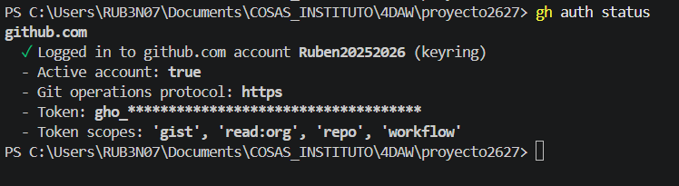
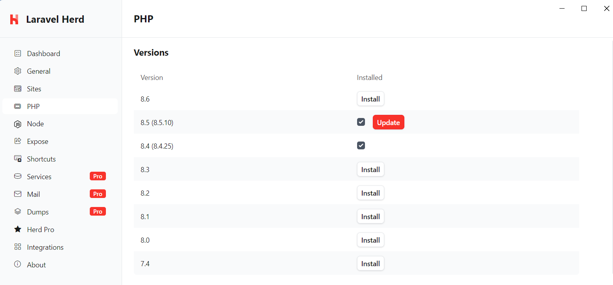
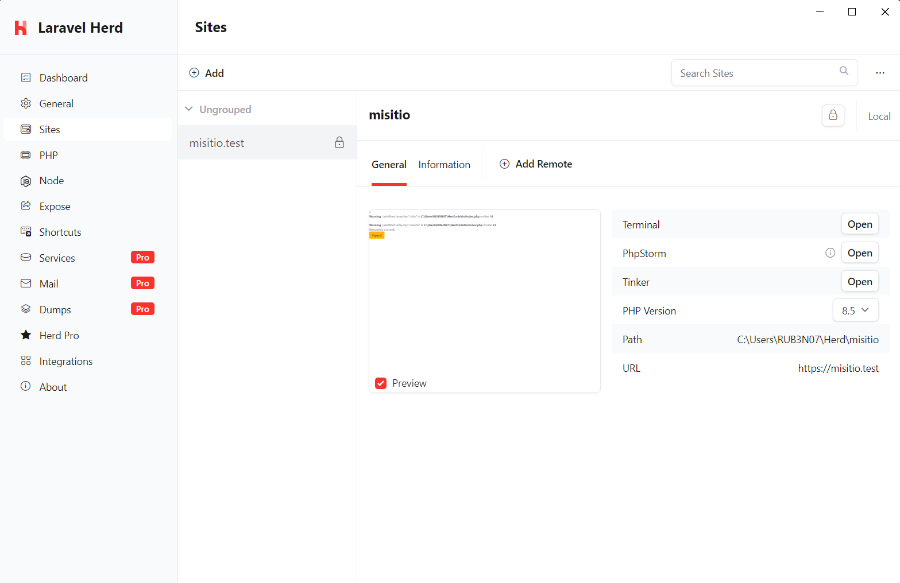

# DOCUMENTACION

_1.Git instalado y configurado en local_

He instalado y configurado git en mi ordenador personal. Demostración de que lo tengo instalado: 

 _2.GitHub CLI instalado y configurado (gh auth status)_

He realizado los pasos para configurar e instalar Github CLI. Esto es lo que saldría una vez instalado: 

 _3.Herd instalado con la versión de PHP 8.4_

He instalado "Herd" con la versión de PHP adecuada. Así es como lo tendría:

 _4.Repositorio "misitio" clonado en local_

Mi repositorio creado en Github, está clonado y vinculado en VSCODE. Así es como saldría:

 _5.Herd enlazado al repositorio "misitio" y sirviéndolo en  HTTPS_

El repositorio de "misitio", está enlazado con Herd y funcionando sirviéndolo en HTTPS.

 _6.Plugins y elementos utilizados de "ReadtheDocs"_

Tengo instalado los plugins y elementos de "ReadtheDocs", pero de momento, no he requerido utilizarlo.